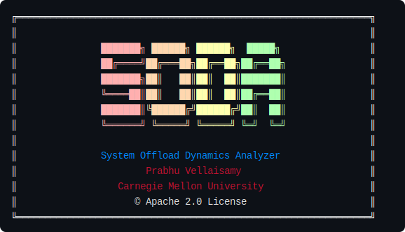
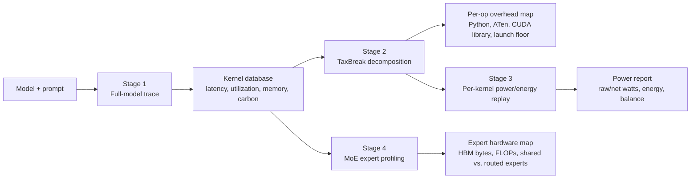

# SODA — System Offload Dynamics Analyzer




[](LICENSE)


LLM inference on GPUs wastes significant time between kernel launches — in Python dispatch, vendor library front-ends, and CUDA driver overhead. That time is invisible to conventional profilers.

**SODA** instruments this gap. It decomposes the host-side overhead of every kernel invocation into four independently attributable components — Python translation, ATen dispatch, CUDA library overhead, and kernel launch floor — and maps them to the operations driving them. The result is a per-operation breakdown that tells you not just *that* your model is host-bound, but exactly *which layer* of the stack is the bottleneck and by how much.

## How It Works

SODA operates in three progressive stages, each building on the last:



| Phase | Depends on | Main question answered | Primary output |
| --- | --- | --- | --- |
| Stage 1: full-model trace | Model run | Is inference host-bound, fragmented, memory-heavy, or energy-heavy? | Full-run metrics and kernel database |
| Stage 2: TaxBreak decomposition | Stage 1 kernel database | Which software layer creates launch overhead per operation? | Python / ATen / CUDA library / launch-floor breakdown |
| Stage 3: per-kernel power/energy replay | Stage 2 TaxBreak replay | Which kernels consume power and energy, and how does kernel-active energy compare to full-inference energy? | `taxbreak/power_report.json` with per-kernel watts, µJ, and energy balance |
| Stage 4: MoE expert profiling | Live MoE inference pass | Which expert paths drive memory traffic and compute? | Shared-vs-routed expert HBM/FLOP attribution |

**Stage 1 — Full-model trace** runs 150 profiled inference passes under PyTorch Profiler and extracts per-kernel timing sequences from the Chrome trace. This gives you GPU utilization, TTFT/TPOT latency, throughput, memory footprint, kernel fragmentation, and carbon footprint — with no additional tooling.

**Stage 2 — TaxBreak decomposition** replays each unique kernel in isolation under Nsight Systems and subtracts a measured null-kernel floor, exposing the purely software-attributable launch overhead. This separates framework translation time (Python + ATen), vendor library front-end cost (cuBLAS/cuDNN), and the irreducible hardware launch floor per kernel. Roofline plots are generated when NCU profiling is enabled.

**Stage 3 — Per-kernel power/energy replay** uses NVML power sampling and hardware energy counters during isolated kernel replays to report raw power, idle-subtracted net power, kernel-active energy, and an energy balance against Stage 1 inference-level energy.

**Stage 4 — MoE expert profiling** uses CUPTI hardware counters inside a live inference pass to attribute HBM bytes and compute FLOPs per expert type (shared vs. routed), exposing the memory access patterns that aggregate HDBI scores hide.

## Installation

```bash
conda create -y -n soda-311 python=3.11
conda activate soda-311
conda install -y -c pytorch -c nvidia pytorch pytorch-cuda=12.1
git clone https://github.com/prabsy96/SODA---System-Offload-Dynamics-Analyzer.git
cd SODA---System-Offload-Dynamics-Analyzer
pip install -e .
source env.sh   # required before every run
```

## Quick Start

```bash
# Stage 1: full-model trace
soda-cli -m gpt2 --output-dir output/ --seq-len 512 --batch-size 1

# Stage 2: TaxBreak decomposition (requires Stage 1 kernel database)
soda-cli -m gpt2 --output-dir output/ --kernel-db
soda-cli --taxbreak --kernel-db-path output/gpt2_.../kernel_database.json

# Stage 3: per-kernel power/energy replay
soda-cli --taxbreak --kernel-db-path output/gpt2_.../kernel_database.json --power-replay
```

Full CLI reference, pipelines, SLURM, and Docker: **[docs/USER_MANUAL.md](docs/USER_MANUAL.md)**

## Citation

If you use SODA in your research or product, **cite both papers**:

**ISPASS 2025 — TKLQT Characterization:**

```bibtex
@INPROCEEDINGS{11096369,
  author={Vellaisamy, Prabhu and Labonte, Thomas and Chakraborty, Sourav and Turner, Matt and Sury, Samantika and Shen, John Paul},
  booktitle={2025 IEEE International Symposium on Performance Analysis of Systems and Software (ISPASS)},
  title={Characterizing and Optimizing LLM Inference Workloads on CPU-GPU Coupled Architectures},
  year={2025},
  pages={49-61},
  doi={10.1109/ISPASS64960.2025.00015}}
```

**ISPASS 2026 — TaxBreak:**

```bibtex
@article{vellaisamy2026taxbreak,
  title={TaxBreak: Unmasking the Hidden Costs of LLM Inference Through Overhead Decomposition},
  author={Vellaisamy, Prabhu and Tripathi, Shreesh and Natarajan, Vignesh and Thenarasu, Surya Santhan and Blanton, Shawn and Shen, John P},
  journal={arXiv preprint arXiv:2603.12465},
  year={2026}
}
```
